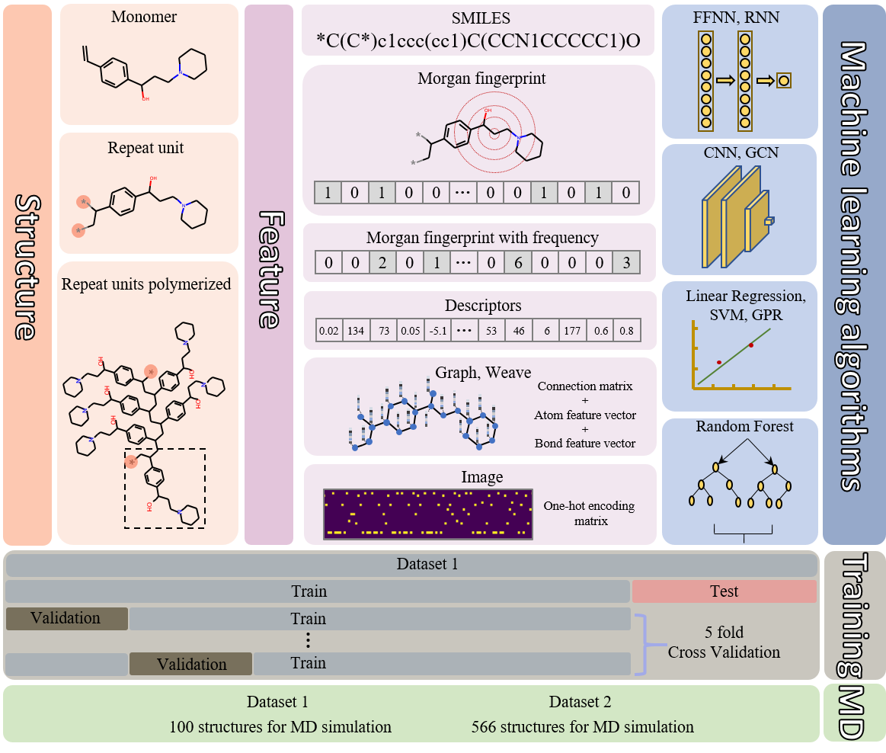

# Tg_Benchmarking
Code and data for the paper [Benchmarking Machine Learning Models for Polymer Informatics: An Example of Glass Transition Temperature](https://pubs.acs.org/doi/abs/10.1021/acs.jcim.1c01031).

# Code
Code to compare the true Tg and predicted Tg from differnet machine learning models. 

# Data
- All the polymer data can be found in the PolyInfo database https://polymer.nims.go.jp/en/ (National Institute for Materials Science (NIMS) holds the copyright of this database system).
- MD simulated 566 polymers in Dataset_2 of the paper are listed in csv file. 
- MD simulated 100 polymers in Dataset_1 of the paper are listed in excel file. 

# Model
Keras and scikit-learn models are saved into pickle files. 

# Packages
Required packages and versions are listed in the requirements.txt.

